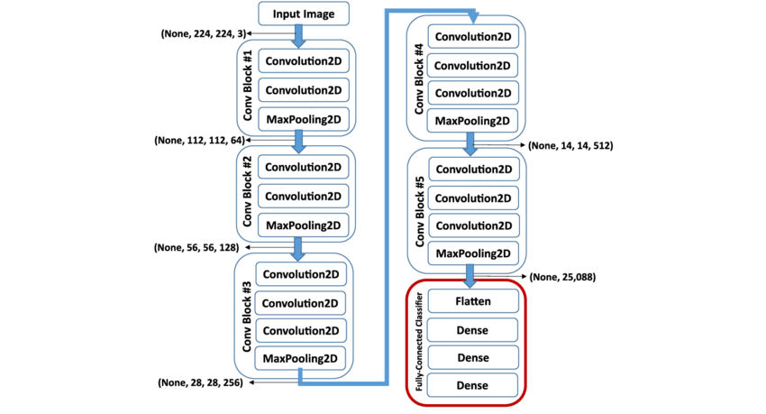

# Classifying Flowers using Transfer Learning in Keras

The target of this project is to experiment transfer learning using a Convolutional Neural Network pre-trained on ImageNet.

## Dataset
The Data set used in this project is the flower dataset (http://download.tensorflow.org/example_images/flower_photos.tgz). This dataset has 5 classes (Daisy, Dandelion, Rese, Sunflower, and Tulip).

## Models
The  model to be used is VGG16 without the fully connected layers.

Source: https://www.researchgate.net/profile/Kasthurirangan_Gopalakrishnan/publication/319952138/figure/fig2/AS:613973590282251@1523394119133/A-schematic-of-the-VGG-16-Deep-Convolutional-Neural-Network-DCNN-architecture-trained.png

### Models 1
In this model we will only train the added fully connected layers.

Five different hyperparameters values were tried, but the accuracy was not changed in any of the scenarios.

### Models 2
In this model we will train the added fully connected layers and also the block5 of VGG16.

### Models 3
In this model we will train all layers, the fully connected and also VGG16 layers.

## Result
The better model in this experiment is Model 3, because all the layers of the newly created CNN model were trained with this specific data set.
